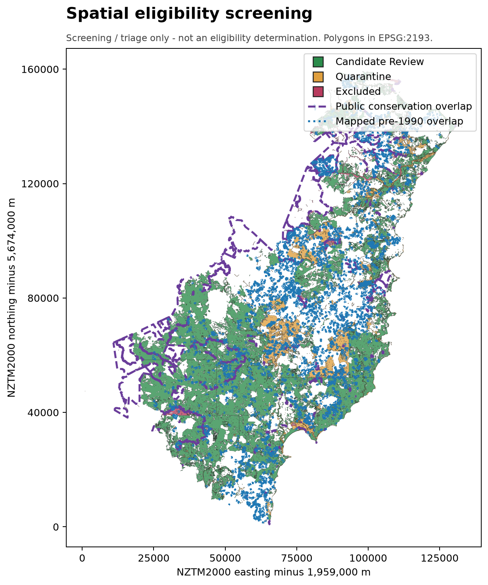
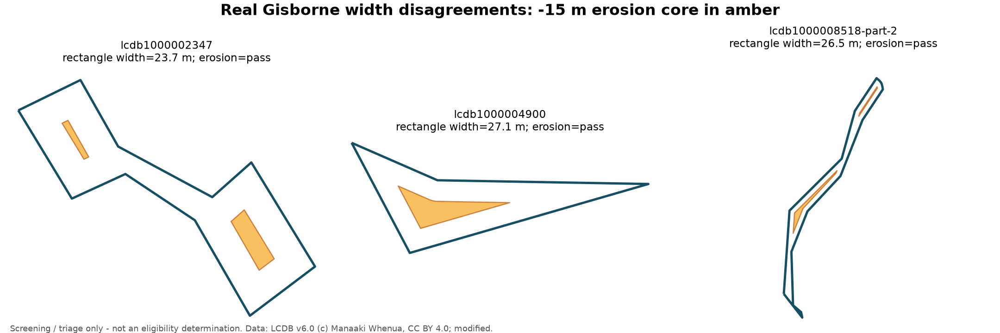

# NZ ETS Forest Land — Spatial Eligibility Screening

> **This is a screening / triage tool, not an eligibility determination.**
> It identifies candidate areas for assessor review using the subset of ETS
> forest-land criteria that can be tested from open spatial data. Species,
> canopy cover and height at maturity, ownership and registered rights, and the
> complete 1989/1990 land-status history remain assessor decisions.

[](https://github.com/Kenchch/nz-ets-forest-eligibility-screening/actions/workflows/ci.yml)

An auditable Python/GeoPandas workflow for prioritising potential
**post-1989 forest-land** cases in **Gisborne District**. The committed primary
run uses 5,748 real LCDB v6 observations clipped against official open-data
layers; the small synthetic fixtures remain only for isolated tests.



## Findings

### 1. Width is materially method-dependent

The `2A/P` and `-15 m` erosion proxies disagree on **694 of 5,748 polygons
(12.07%)**. All 694 run in the same direction: a local 30 m core survives, but
the compactness-sensitive `2A/P` result is below 30 m.



The erosion test is retained as the primary narrow-strip diagnostic because it
directly tests whether a 30 m-wide core exists. It is **not** accepted as proof
of average width: every disagreement is quarantined under R-02. Long branching,
dumbbell and highly concave polygons can retain a core while still failing
MPI's formal centre-line average.

### 2. The real CRS failure mode is false rejection

In EPSG:2193, **4,223** polygons meet the 1 ha area threshold. If the same
geometries are transformed to EPSG:4326 and square degrees are naively compared
with 10,000 square metres, **all 4,223 are falsely rejected** and none are
falsely qualified. This corrects the initial project hypothesis rather than
forcing the result to match it. Every pipeline entry point therefore fails
loudly unless the CRS is EPSG:2193.

### 3. Imagery review finds substantial false positives

A fixed-seed sample of **30** automated candidates was reviewed against 2024
Gisborne imagery:

| Visual label | Count |
|---|---:|
| Plausible plantable | 13 |
| Already forested | 5 |
| Clearly not plantable | 12 |

The visual agreement rate is **13/30 (43.3%)**. Obvious false positives mainly
follow active riverbeds, coastal margins, roads or erosion features; five
others appear already forested or recently harvested. The [dated labels and
evidence notes](outputs/gisborne/review/review_labels.csv), [30 image
cards](outputs/gisborne/review/cards/) and contact sheets are committed. This is
a single AI-assisted visual review from one imagery date with no independent
ground truth, not a formal accuracy assessment.

### 4. Screening disposition remains reviewable

| Result | Polygons |
|---|---:|
| Candidate review | 2,520 |
| Quarantine | 2,926 |
| Excluded by project conservation policy | 302 |

The automated reject/exclude rate is **56.16%**, below the consistent 80% batch
abort threshold. Failures remain in `quarantine.gpkg` with rule IDs, overlap
area and overlap percentage; no geometry is silently deleted.

## Rules and decision boundary

| Rule | Automated treatment | Decision limit |
|---|---|---|
| R-01 area at least 1 ha | Raw metric area controls the test; rounded value is display only | Other criteria remain |
| R-02 average width at least 30 m | Compare two proxies; erosion is primary; disagreement is quarantined | MPI centre-line measurement is still required |
| R-03 post-1989 rather than mapped pre-1990 | LUCAS 1989/2007 planted-forest overlap greater than 1 m² | Absence of mapped overlap cannot prove land history |
| R-04 public conservation overlap | DOC overlap greater than 1 m² excludes from this opportunity queue | Project policy, not statutory ineligibility |
| R-05 potentially plantable current cover | Configurable LCDB proxy allow-list | Current cover cannot prove future forest |
| R-06 forest species | Not automated | Manual evidence required |
| R-07 crown cover over 30% in each hectare | Not automated | Manual evidence required |
| R-08 capable of 5 m at maturity | Not automated | Manual evidence required |

Boundary-only contact has zero area and does not fail R-03/R-04. The pipeline
records exact intersection area rather than using `intersects`, which would
misclassify adjacent LCDB polygons that only share an edge.

The [rule register](rules/rule_register.csv) and [source notes](rules/SOURCES.md)
link each interpretation to the current Act and MPI guidance.

## Data and method

The reproducible study uses:

- Stats NZ Territorial Authority 2026 boundary;
- LCDB v6.0 land cover, streamed from an ArcGIS Living Atlas mirror and
  simplified by that service at 15 m;
- MfE LUCAS NZ Land Use Map 2020 v005;
- DOC Public Conservation Land;
- Gisborne District Council 2024 satellite imagery, credited by the service to
  LINZ, for the 30-card visual review.

All vector processing is in NZTM2000 (EPSG:2193). The acquisition script queries
nationwide services by the Gisborne bounding box, repairs invalid source
geometries, clips to the district, explodes multipart candidates and assigns
stable IDs. The candidate source includes explicit non-plantable LCDB controls
so R-05 is tested rather than made tautological by preprocessing.

```text
official boundary + LCDB + LUCAS + DOC
                 |
       download, make-valid, clip
                 |
       assert EPSG:2193 + schema
                 |
   R-01 ... R-05 + overlap area evidence
                 |
    candidate / quarantine / excluded
                 |
  fixed-seed 30-card imagery review
```

## Reproduce

The committed processed inputs total about 12 MB and are pinned by SHA-256.
`reproduce.py` reads those files directly; it no longer rebuilds unused in-memory
demo shapes.

```bash
conda env create -f environment.yml
conda activate nz-ets-screening
pytest
python scripts/verify_checksums.py
python scripts/reproduce.py
```

To refresh from the public services:

```bash
python scripts/download_gisborne_data.py
python scripts/reproduce.py
python scripts/download_review_cards.py
```

`LINZ_BASEMAP_API_KEY` is optional for the interactive review map. The main
pipeline propagates it when present and otherwise writes a valid key-free URL;
it never writes `YOUR_API_KEY`. Static committed review cards use the official
Gisborne imagery service and require no secret.

CI runs the test suite, verifies every pinned input, reproduces the real
Gisborne run and compares deterministic CSV findings plus semantic GeoPackage
content hashes. Volatile GeoPackage timestamps and PDF metadata are normalised.

## Tests and peer-review controls

- 18 tests cover CRS, area, both width methods, boundary-only contact, true
  overlap, each rule's own failure reason, API-key propagation and the 80%
  publication gate.
- The 0.99996 ha fixture displays as 1.0000 ha but correctly fails because the
  raw value controls R-01.
- Corrupted copies independently trigger small area, narrow geometry, wrong
  CRS, pre-1990 overlap and conservation overlap.
- `manual_review_rule_ids` always carries R-03/R-06/R-07/R-08 forward.

## ArcGIS Pro

[`arcgis/ets_screening.pyt`](arcgis/ets_screening.pyt) is a thin ArcGIS Pro
wrapper around the tested package and uses the same 80% threshold. It has been
statically reviewed but **not executed under `arcpy` on this machine** because
ArcGIS Pro is unavailable. The [reference PDF](arcgis/layout_map.pdf) is
generated by Matplotlib from the real Gisborne run; it is not represented as an
ArcGIS-authored layout.

## Limitations

- The LCDB streaming mirror simplifies geometry at 15 m, which can affect
  narrow-feature diagnostics; refresh from the primary LRIS export when a
  portal token is available.
- R-02 remains a proxy. Formal MPI width uses perpendicular measurements at
  20 m intervals along a centre line following the longest path.
- LUCAS is mapped evidence, not a register of ETS status, liabilities or
  satisfied surrender obligations.
- LCDB class age and interpretation create false positives and negatives.
- R-04 and R-05 are prioritisation policies, not statutory eligibility tests.
- The imagery review is small, single-reviewer and AI-assisted, with no field
  validation or independent ground truth.
- Species, future height/crown cover, title, forestry rights and evidence
  authenticity remain outside the automated scope.

## Repository map

```text
rules/       rule register and verified primary sources
data/        pinned real inputs, hashes, provenance and synthetic test fixtures
src/         validation, geometry diagnostics, rules, pipeline and review queue
tests/       corrupted-fixture and publication-gate tests
outputs/     real Gisborne findings, maps, GeoPackages and imagery review
notebooks/   executed real-data width/CRS/review walkthrough
arcgis/      thin ArcGIS Pro wrapper and reference PDF
```

Code is MIT licensed. Source data retain their publishers' licences and
attribution requirements. This independent portfolio project is not endorsed by
MPI, EPA, LINZ, MfE, DOC, Stats NZ, Gisborne District Council or Manaaki Whenua.
