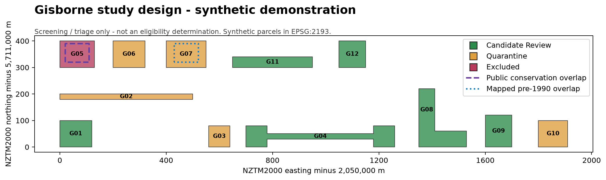
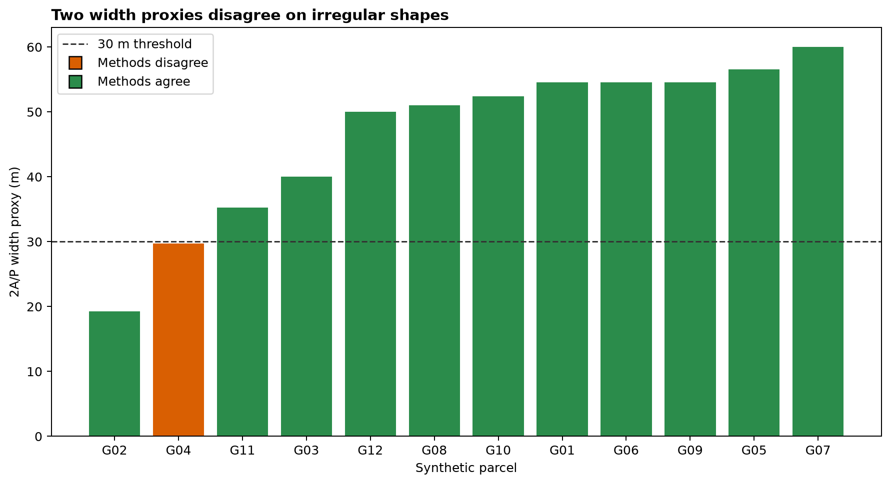

# NZ ETS Forest Land - Spatial Eligibility Screening

> **This is a screening / triage tool, not an eligibility determination.**
> It identifies candidate areas for assessor review using the subset of ETS
> forest-land criteria that can be tested from open spatial data. Several
> criteria - species, canopy cover at maturity, height at maturity, land
> ownership and the 1989/1990 land-status history - cannot be established from
> these layers and are explicitly out of scope.

[](https://github.com/Kenchch/nz-ets-forest-eligibility-screening/actions/workflows/ci.yml)

An auditable Python/GeoPandas workflow for prioritising **post-1989 forest-land** cases in Gisborne District. It implements only defensible open-data checks, quarantines rather than deletes, and carries the rule ID and observed value into every result. The committed run uses invented NZTM geometries so that the repository can be tested without redistributing large or account-gated datasets.



## Why

Forestry ETS assessment combines geometry, historic aerial and satellite imagery, land history, applicant evidence, legal rights and judgement. Automating all of that would create false certainty. This project instead automates a narrow first pass: reject clearly undersized or narrow shapes, flag overlaps and weak land-cover proxies, then send the remaining cases to an assessor with unresolved rules visible.

## Scope and decision boundary

| Rule | Screening treatment | Can this decide eligibility? |
|---|---|---|
| R-01 area at least 1 ha | Exact metric area in EPSG:2193 | No - other criteria remain |
| R-02 average width at least 30 m | Two geometry proxies; erosion result drives triage | **No - MPI's centre-line method is different** |
| R-03 post-1989 rather than mapped pre-1990 | Partial overlay flag | No - complete land history needs evidence |
| R-04 public conservation overlap | Project-specific exclusion from this opportunity queue | No - not a statutory ineligibility rule |
| R-05 potentially plantable current cover | Configurable LCDB proxy allow-list | No - current cover is neither future forest nor legal status |
| R-06 forest species | Not automated | Manual evidence required |
| R-07 crown cover over 30% in each hectare | Not automated | Manual imagery/supporting evidence required |
| R-08 capable of 5 m at maturity | Not automated | Manual species and site evidence required |

Full clauses, URLs, implementation notes and actions are in [`rules/rule_register.csv`](rules/rule_register.csv) and [`rules/SOURCES.md`](rules/SOURCES.md).

## Findings from the reproducible demonstration

The figures and counts below describe **12 synthetic shapes**, not Gisborne land.

1. **The two width proxies disagree on an irregular shape.** They differ on **1 of 12** synthetic polygons: G04, a dumbbell with two wide lobes joined by a long 20 m neck. `2A/P` is 29.714 m and fails; a core survives the `-15 m` buffer and passes. The conflict is retained as a review signal, not resolved by pretending one proxy is the legal answer.
2. **CRS is a control, not metadata decoration.** A 100 m by 100 m square is exactly 1 ha in NZTM2000. Reprojecting it to EPSG:4326 and treating square degrees as square metres makes the threshold meaningless, so every entry point fails unless the CRS resolves to EPSG:2193.
3. **Open layers do not close the decision.** Even a parcel that passes all five automated/proxy checks carries `R-03|R-06|R-07|R-08` in `manual_review_rule_ids`.
4. **Failures remain inspectable.** Six of 12 features enter `candidate_review`; five are quarantined and one is excluded by the project-specific conservation overlay. Every input feature appears in either `candidates.gpkg` or `quarantine.gpkg`; no rejected geometry is deleted.



## Method

```text
candidate polygons + pre-1990 evidence + conservation evidence
                       |
                validate EPSG:2193
                       |
     R-01 area ---- R-02 width diagnostics ---- R-03/R-04 overlays ---- R-05 LCDB proxy
                       |
          +------------+-------------+
          |                          |
   candidate_review           quarantine / excluded
          |                          |
          +------ rule_results.csv --+
                       |
          fixed-seed human imagery review queue
```

- Input validation fails loudly for a missing/wrong CRS, invalid geometry, missing fields or duplicate IDs.
- The batch aborts before publication if the rejected/excluded share exceeds the configured threshold.
- Outputs are built in a staging directory and promoted only after every file and figure succeeds.
- `rule_results.csv` contains eight audit rows per feature, including explicit null outcomes for R-06 to R-08.

## Width: why neither proxy is the legal answer

MPI's current guidance asks the mapper to follow the longest path with a centre line, measure perpendicular widths at 20 m intervals, then average them. A robust automated centre line for branching and multipart shapes is a significant method in its own right.

This project therefore uses two transparent diagnostics:

```python
width_area_perimeter = 2 * area / perimeter
erosion_core_exists = not polygon.buffer(-15).is_empty
```

`2A/P` is useful for finding low-compactness strips but understates many regular shapes. Erosion catches shapes that are nowhere 30 m wide, but a dumbbell with two wide lobes and a narrow neck can still pass. R-02 is consequently labelled **proxy** in the register and every automated pass remains subject to formal measurement and assessor review.

## Reproduce

```bash
conda env create -f environment.yml
conda activate nz-ets-screening
pytest
python scripts/verify_checksums.py
python scripts/reproduce.py
```

Or with `venv`:

```bash
python -m venv .venv
.venv/Scripts/python -m pip install -e ".[dev]"   # Windows
.venv/Scripts/python -m pytest
.venv/Scripts/python scripts/verify_checksums.py
.venv/Scripts/python scripts/reproduce.py
```

For real inputs:

```bash
ets-screen \
  --candidates data/raw/gisborne_candidates.gpkg \
  --pre1990 data/raw/gisborne_pre1990_evidence.gpkg \
  --conservation data/raw/gisborne_conservation.gpkg \
  --output outputs/real-run \
  --reject-rate-threshold 0.80
```

Input acquisition and preprocessing are documented in [`data/README.md`](data/README.md). Raw source files and API keys are never committed.

## Human aerial-imagery review

The pipeline selects up to 30 passing candidates with seed `20260912` and writes:

- `outputs/review/review_queue.gpkg`
- `outputs/review/review_labels_template.csv`
- `outputs/review/review_map.html`

Set `LINZ_BASEMAP_API_KEY` before the run to embed a current LINZ aerial tile URL. A reviewer assigns one of `plausible-plantable`, `already-forested`, or `clearly-not-plantable` and records a dated evidence note. The committed synthetic run does **not** report an imagery accuracy or agreement rate because it has no real imagery and no independent ground truth.

## ArcGIS Pro

[`arcgis/ets_screening.pyt`](arcgis/ets_screening.pyt) is a thin ArcGIS Pro wrapper around the tested Python pipeline. It deliberately contains no duplicate business rules. [`arcgis/layout_map.pdf`](arcgis/layout_map.pdf) is the reproducible reference layout generated from the synthetic run; it is labelled as a demonstration and is not represented as an ArcGIS-authored official product.

## Limitations

- The committed evidence is synthetic. No claim is made about the number or distribution of candidate areas in Gisborne.
- R-02 uses screening proxies, not MPI's formal average-width method.
- LCDB currency and classification can create both false positives and false negatives.
- The supplied pre-1990 layer is only a cross-check; absence of overlap cannot prove post-1989 status.
- Public conservation overlap is a project triage policy, not automatic legal ineligibility. Ownership, registered forestry rights, leases and Crown conservation contracts require authoritative review.
- Species, potential mature height, future crown cover, land-use history and documentary authenticity are outside the automated scope.
- The review queue supports one-person visual triage; it is not a peer-reviewed accuracy assessment.

## Repository map

```text
rules/       rule register and verified primary sources
data/        download contract, hashes and synthetic fixtures
src/         CRS checks, geometry diagnostics, rules, pipeline and review queue
tests/       synthetic corruption tests and publication-gate tests
arcgis/      ArcGIS Pro thin wrapper and reference map PDF
notebooks/   width-method comparison walkthrough
outputs/     committed deterministic summaries, maps and review template
```

## Licence and attribution

Code is MIT licensed. Source datasets retain their publishers' licences and attribution requirements. LINZ aerial imagery must display the attribution supplied by LINZ Basemaps. This repository is an independent portfolio project and is not endorsed by MPI, the EPA, LINZ, MfE, DOC or Manaaki Whenua.
